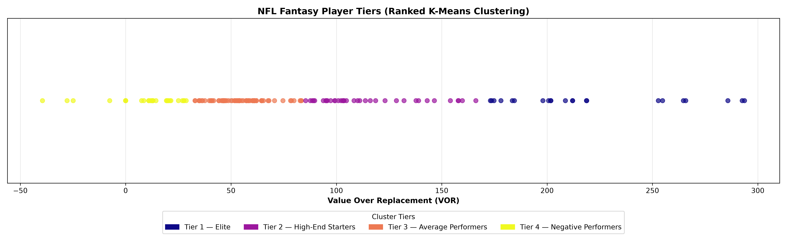
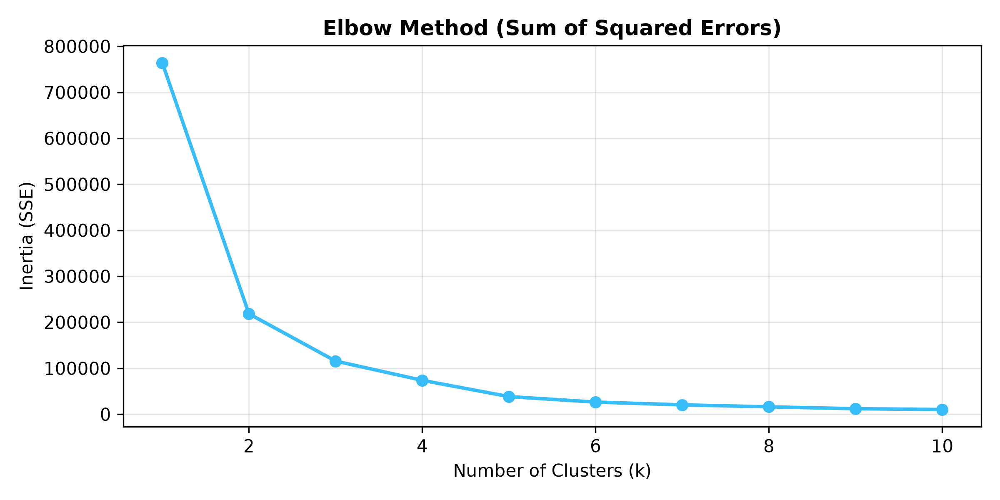
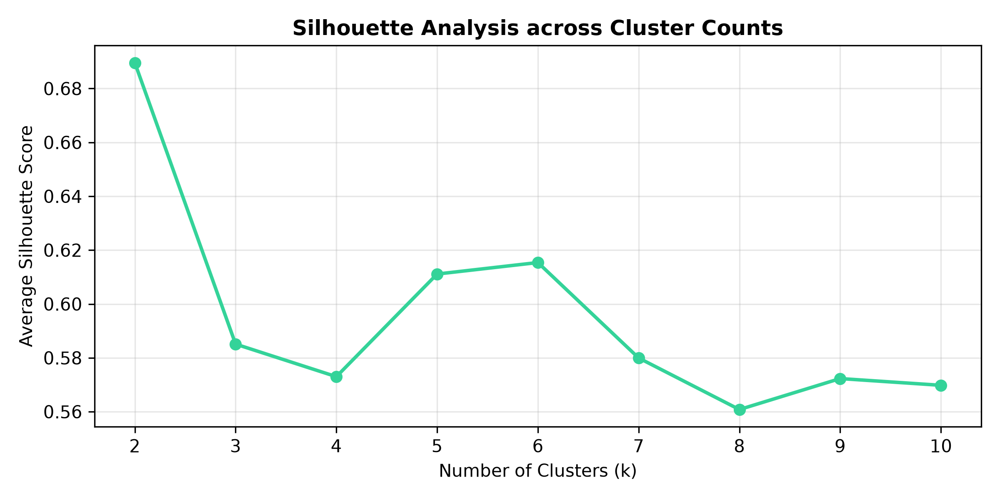
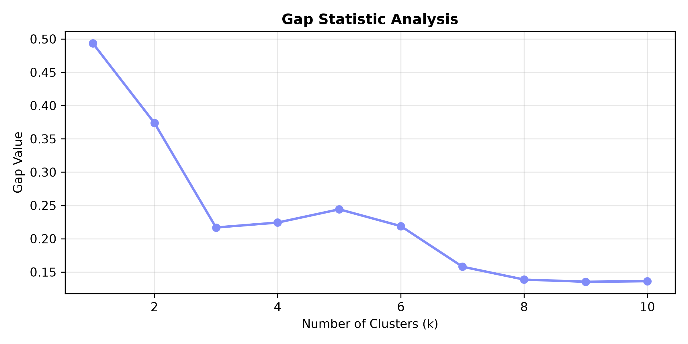

# NFL Player Performance & Fantasy Tier Clustering

[](https://colab.research.google.com/github/benman17/NFL-Clustering/blob/main/notebooks/NFL_Clustering.ipynb)
[](https://www.python.org/)
[](https://scikit-learn.org/)
[](https://opensource.org/licenses/MIT)

An end-to-end unsupervised machine learning pipeline that partitions NFL players into actionable fantasy performance tiers. By evaluating multi-category player performance through a **Value Over Replacement (VOR)** framework and optimizing **K-Means clustering**, this project eliminates draft recency bias and isolates true positional scarcity.

---

## Key Highlights

- **Custom Scoring Engine**: Full multi-category scoring model supporting Standard PPR and Individual Defensive Player (IDP) scoring systems.
- **Value Over Replacement (VOR) Modeling**: Dynamic calculation of replacement baselines per position ($k$-th available starter) to establish cross-position draft leverage.
- **Cluster Diagnostics**: Triple-method cluster optimization combining the **Elbow Method** (SSE), **Silhouette Analysis**, and **Gap Statistic** (Monte Carlo dispersion).
- **Ranked Fantasy Tiers**: Automated sorting and classification into four distinct draft tiers from *Tier 1 — Elite* to *Tier 4 — Negative Performers*.
- **Benchmarking**: Cross-validated against industry-standard FantasyPros consensus draft rankings.
- **Modular Codebase**: Production-grade architecture with reusable modules, automated CLI pipeline, and interactive Jupyter / Google Colab notebook.

---

## Clustered Tier Distribution



| Tier | Classification | Description | Sample Core Players |
|---|---|---|---|
| **Tier 1** | **Elite** | Dominant positional difference-makers with elite cross-position VOR | Ja'Marr Chase, Lamar Jackson, Saquon Barkley, Jahmyr Gibbs, Josh Allen |
| **Tier 2** | **High-End Starters** | Reliable weekly fantasy starters with positive VOR floor | CeeDee Lamb, Puka Nacua, Derrick Henry, Brock Bowers, Baker Mayfield |
| **Tier 3** | **Average Performers** | Solid flex plays and depth contributors near replacement baseline | Brian Thomas Jr., Nico Collins, Jayden Daniels, George Kittle |
| **Tier 4** | **Negative Performers** | Below-replacement level contributors or players impacted by injuries | Depth backups, committee members, sub-replacement reserves |

---

## Methodology & Optimization

To prevent arbitrary cluster selection, the pipeline evaluates the optimal number of player tiers ($k$) across three distinct clustering diagnostics:

<p align="center">
  
  
  
</p>

1. **Elbow Method**: Shows a distinct inflection point (elbow) at $k = 4$, where incremental Sum of Squared Errors (SSE) reduction stabilizes.
2. **Silhouette Analysis**: Confirms cohesive intra-cluster separation and bounded boundaries between adjacent tiers.
3. **Gap Statistic**: Validates that clustering structure significantly exceeds a null uniform reference distribution across simulated dispersions.

---

## Scoring Architecture

### 1. PPR + IDP Scoring Multipliers
```math
\text{Points} = (0.04 \cdot \text{PassYds}) + (4 \cdot \text{PassTD}) - (2 \cdot \text{INT}) + (0.1 \cdot \text{RushYds}) + (6 \cdot \text{RushTD}) + (1.0 \cdot \text{Rec}) + (0.1 \cdot \text{RecYds}) + (6 \cdot \text{RecTD}) - (2 \cdot \text{Fumbles}) + (1.5 \cdot \text{Tackles}) + (4.0 \cdot \text{Sacks}) + (6.0 \cdot \text{DefINT}) + (3.0 \cdot \text{FF}) + (6.0 \cdot \text{DefTD})
```

### 2. Value Over Replacement (VOR)
Replacement thresholds are established dynamically based on standard 12-team roster demand:

| Position | Replacement Baseline ($N$-th Rank) | Focus |
|---|:---:|---|
| **Quarterback (QB)** | 24 | Top 2 starters per team |
| **Running Back (RB)** | 48 | Top 4 options per team |
| **Wide Receiver (WR)** | 60 | Top 5 options per team |
| **Tight End (TE)** | 24 | Top 2 starters per team |
| **Defensive Line (DL)** | 24 | Top 2 edge/interior rushers |
| **Linebacker (LB)** | 36 | Top 3 tackle producers |
| **Defensive Back (DB)** | 36 | Top 3 safeties / playmaking corners |

$$\text{VOR} = \text{Calculated Fantasy Points} - \text{Replacement Points}_{\text{Position}}$$

---

## Repository Structure

```
NFL-Clustering/
├── data/
│   ├── raw/
│   │   └── sample_nfl_player_stats_2024.csv    # Offline starter dataset (2024 season)
│   └── processed/
│       └── nfl_player_tiers_2024.csv           # Exported clustered tier outputs
├── notebooks/
│   └── NFL_Clustering.ipynb                    # Interactive Jupyter & Colab notebook
├── reports/
│   └── figures/                                # Publication-quality generated figures
│       ├── elbow_method.png                    # Elbow curve diagnostic
│       ├── silhouette_score.png                # Silhouette score diagnostic
│       ├── gap_statistic.png                   # Gap statistic curve
│       ├── fantasy_player_tiers_plasma.png     # Ranked cluster scatter plot
│       ├── players_per_tier_bar.png            # Tier volume histogram
│       └── vor_distribution.png                # VOR density distribution
├── src/
│   ├── __init__.py                             # Package metadata
│   ├── config.py                               # Scoring parameters, baselines, and seeds
│   ├── data_loader.py                          # SportsData.io API and local data ingestion
│   ├── preprocessing.py                        # Position mapping, scoring, and VOR engine
│   ├── clustering.py                           # K-Means, Elbow, Silhouette, Gap Statistic
│   └── visualization.py                        # Chart generation and diagnostic plotting
├── main.py                                     # End-to-end CLI execution script
├── requirements.txt                            # Pinned Python package dependencies
├── .gitignore                                  # Git exclusion rules for Python & Jupyter
└── README.md                                   # Project documentation
```

---

## How to View & Run

### 1. Interactive Google Colab Notebook
Click either badge below to launch the interactive notebook:

- **Launch directly via GitHub**:  
  [](https://colab.research.google.com/github/benman17/NFL-Clustering/blob/main/notebooks/NFL_Clustering.ipynb)
- **Launch via Google Drive**:  
  [](https://colab.research.google.com/drive/19Obj04aWwSKiH__0_LKkCPLkLthV7C-z?usp=sharing)

### 2. Local Setup & Execution

1. **Clone the repository**:
   ```bash
   git clone https://github.com/benman17/NFL-Clustering.git
   cd NFL-Clustering
   ```

2. **Create and activate a virtual environment**:
   ```bash
   python -m venv venv
   # On Windows:
   venv\Scripts\activate
   # On macOS/Linux:
   source venv/bin/activate
   ```

3. **Install dependencies**:
   ```bash
   pip install -r requirements.txt
   ```

4. **Run the pipeline**:
   ```bash
   # Run with default sample data:
   python main.py

   # Or run with custom clusters and custom dataset:
   python main.py --clusters 4 --data-path data/raw/sample_nfl_player_stats_2024.csv
   ```

5. **Open the notebook locally**:
   ```bash
   jupyter notebook notebooks/NFL_Clustering.ipynb
   ```

---

## Tech Stack

- **Language**: Python 3.10+
- **Machine Learning**: `scikit-learn` (K-Means, Silhouette Score, Pairwise Distances)
- **Data Engineering**: `pandas`, `numpy`, `requests`
- **Visualization**: `matplotlib`, `seaborn`
- **Interactive Platform**: Google Colab / Jupyter Notebooks

---

## License

This project is licensed under the [MIT License](LICENSE).
